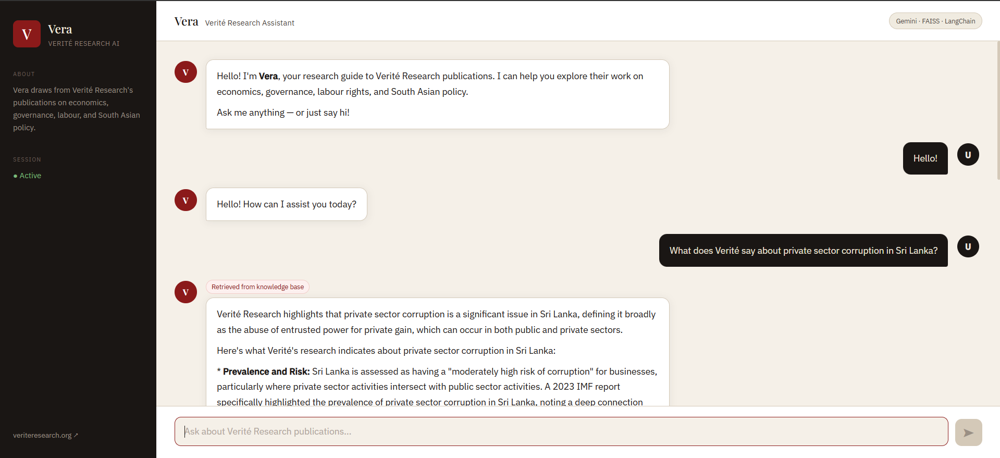

# Vera — Verité Research Agentic RAG Chatbot

An agentic AI chatbot that lets users have natural conversations about Verité Research publications. Vera remembers conversations, only searches when genuinely needed, cites her sources, and politely declines anything outside Verité's work.

**Live URL**: https://verite-research-assistant.vercel.app

---

## Architecture

```
User → React Frontend (Vercel)
         ↓ POST /chat
      FastAPI Backend (AWS EC2 + Ngrok HTTPS)
         ↓ classify intent
      Gemini 1.5 Flash (classifier + responder)
         ↓ if search needed
      EnsembleRetriever (FAISS 60% + BM25 40%)
         ↓
      SQLite long-term memory (per user, across sessions)
```

---

## Features

| Feature | Implementation |
|---------|---------------|
| Persona | "Vera" — defined in system prompt |
| Short-term memory | LangChain `ConversationBufferWindowMemory` (10 turns) |
| Long-term memory | SQLite per `user_id`, injected into system prompt on session start |
| Intent routing | Zero-temp Gemini classifier → 5 intent labels |
| Vector search | FAISS with HuggingFace `all-MiniLM-L6-v2` embeddings |
| Keyword search | BM25Retriever |
| Hybrid search | EnsembleRetriever (60% vector / 40% keyword) |
| Citations | Title, page number, chunk preview — clickable in UI |
| Out-of-scope | Polite decline and redirect |
| Borderline questions | Define concept + Verité-specific answer |
| Deployment | Frontend → Vercel · Backend → AWS EC2 t3.small |

---

## Tech Stack

| Area | Choice |
|------|--------|
| LLM | Google Gemini 2.5 Flash |
| Embeddings | HuggingFace `sentence-transformers/all-MiniLM-L6-v2` |
| Vector DB | FAISS (faiss-cpu) |
| Keyword Search | BM25Retriever (rank-bm25) |
| Memory | LangChain + SQLite |
| Framework | LangChain |
| Backend | FastAPI + Uvicorn |
| Frontend | React + Vite |
| Deployment | AWS EC2 t3.small + Vercel |
| HTTPS Tunnel | Ngrok static domain |

---

## Project Structure

```
verite-research-assistant/
├── backend/
│   ├── main.py           # FastAPI app + session management
│   ├── agent.py          # Agentic RAG core (intent → search → reply)
│   ├── memory_store.py   # SQLite long-term memory
│   ├── ingest.py         # PDF chunking + FAISS index builder
│   ├── requirements.txt
│   └── .env.example
├── frontend/
│   ├── src/
│   │   ├── App.jsx
│   │   ├── App.css
│   │   └── components/
│   │       ├── ChatMessage.jsx
│   │       ├── SourcePanel.jsx
│   │       └── TypingIndicator.jsx
│   └── .env.example
├── PROMPTS.md
└── README.md
```

---

## Setup Instructions

### Prerequisites
- Python 3.10+
- Node.js 18+
- Google AI API key — get free at https://aistudio.google.com

### 1 — Clone the repo
```bash
git clone https://github.com/shahmi0519/verite-research-assistant
cd verite-research-assistant
```

### 2 — Backend setup
```bash
cd backend
python -m venv venv
source venv/bin/activate      # Windows: venv\Scripts\activate
pip install -r requirements.txt
cp .env.example .env
# Edit .env and add your GOOGLE_API_KEY
```

### 3 — Add PDFs
```bash
mkdir pdfs
# Download your Verité PDFs into backend/pdfs/
```

### 4 — Build the FAISS index
```bash
python ingest.py --pdf_dir ./pdfs --index_dir ./faiss_index
```

### 5 — Run the backend
```bash
uvicorn main:app --reload --port 8000
```

### 6 — Frontend setup
```bash
cd ../frontend
npm install
cp .env.example .env.local
# Set VITE_API_URL=http://localhost:8000 in .env.local
npm run dev
```

Open **http://localhost:3000**

---

## Environment Variables

### backend/.env.example
```
GOOGLE_API_KEY=your_google_ai_api_key_here
FAISS_INDEX_PATH=./faiss_index
MEMORY_DB_PATH=./memory.db
```

### frontend/.env.example
```
VITE_API_URL=http://localhost:8000
```

**Never commit `.env` files. Always use `.env.example` for documentation.**

---

## Deployment

### Backend — AWS EC2 t3.small
1. Launch Ubuntu 22.04 t3.small instance (free tier)
2. SSH in and install Python 3.10
3. Clone repo, set up venv, install requirements
4. Upload FAISS index via SCP
5. Create `.env` with real API key
6. Run as systemd service for auto-restart on reboot
7. Use Ngrok static domain for HTTPS tunnel

### Frontend — Vercel
1. Import repo in Vercel dashboard
2. Set root directory to `frontend`
3. Add env var: `VITE_API_URL=https://your-ngrok-domain`
4. Deploy

---

## Verité Publications Used

| # | Title | Year | URL |
|---|-------|------|-----|
| 1 | Gaps in the Guardrails: A Review of Laws on Private Sector Corruption in Sri Lanka | 2025 | https://www.veriteresearch.org/publication/gaps-in-the-guardrails-a-legal-review-of-private-sector-corruption-in-sri-lanka/ |
| 2 | Balancing India and China: A Case Study of Sri Lanka | 2024 | https://www.veriteresearch.org/publication/balancing-india-and-china-a-case-study-of-sri-lanka/ |
| 3 | State of the Budget 2026 | 2026 | https://www.veriteresearch.org/publication/state-of-the-budget-2026/ |
| 4 | Sri Lanka: Resolution 30/1 Implementation Monitor | 2024 | https://www.veriteresearch.org/publication/sri-lanka-resolution-30-1-implementation-monitor-august-2024/ |
| 5 | Proactive Disclosure Under the RTI Act in Sri Lanka — Ranking Key Public Authorities in 2024 | 2025 | https://www.veriteresearch.org/publication/proactive-disclosure-under-the-rti-act-in-sri-lanka-ranking-key-public-authorities-in-2024/ |

---

## Sample Questions & Answers

**Q1: Hello!**
> Hello! How can I assist you today?

---

**Q2: What does Verité say about private sector corruption in Sri Lanka?**
> Verité Research highlights that private sector corruption is a significant issue in Sri Lanka, defining it broadly as the abuse of entrusted power for private gain, which can occur in both public and private sectors.
>
> Key findings:
> - **Prevalence and Risk**: Sri Lanka is assessed as having a "moderately high risk of corruption" for businesses, particularly where private sector activities intersect with public sector activities. A 2023 IMF report highlighted a deep connection between public institutions and private firms, rooted in "long-established relationships" between private and public elites.
> - **Forms of Corruption**: Verité's review focuses on two categories — Private Sector as Perpetrators (bid-rigging, commercial bribery) and Private Sector as Enablers (financial secrecy, tax evasion, failing to report suspicious transactions).
> - **Legal Framework Review**: Verité's report benchmarks Sri Lanka's laws against the United Nations Convention Against Corruption (UNCAC) and identifies nine key gaps across three thematic areas: Preventive Measures (3 gaps), Private Sector Bribery (2 gaps), and Trading in Influence (1 gap).
> - **Progress**: The new Anti-Corruption Act (ACA) includes whistleblower protections and allows CIABOC to issue codes of conduct for the private sector.
>
> 📄 Gaps in the Guardrails · p.4  📄 Gaps in the Guardrails · p.7  📄 Gaps in the Guardrails · p.8  📄 Gaps in the Guardrails · p.12  📄 Gaps in the Guardrails · p.16  📄 Gaps in the Guardrails · p.17

---

**Q3: What is corruption?** *(Borderline question — defines concept then grounds in Verité's work)*
> Corruption generally refers to the abuse of entrusted power for private gain. This can occur in both public and private sectors.
>
> Verité Research's work on private sector corruption in Sri Lanka further elaborates on its forms:
> - **Private-to-Public Corruption**: Private entities bribing public officials for contracts, permits, or regulatory advantages.
> - **Private-to-Private Corruption**: Corrupt practices between private sector actors, such as bid-rigging or commercial bribery.
>
> 📄 Gaps in the Guardrails · p.4  📄 Gaps in the Guardrails · p.7  📄 Gaps in the Guardrails · p.9

---

**Q4: Who won the FIFA World Cup 2022?** *(Out-of-scope — polite decline)*
> I'm Vera, and I'm here specifically to help with Verité Research publications. That topic falls outside what I can assist with — but if you have questions about Verité's work on economics, governance, labour, or South Asian policy, I'd love to help!

---

**Q5: Can you summarise what you just told me about corruption laws?** *(Memory — no new search)*
> Certainly! Verité Research's report "Gaps In The Guardrails" conducts a comprehensive review of Sri Lanka's laws benchmarked against UNCAC, identifying nine key gaps across three thematic areas: Preventive Measures (3 gaps), Private Sector Bribery (2 gaps), and Trading in Influence (1 gap).
>
> Despite these gaps, Sri Lanka has made progress — the new Anti-Corruption Act (ACA) includes whistleblower protections and allows CIABOC to issue codes of conduct for the private sector. Other laws on financial record-keeping, auditing, and transparency also contribute to addressing private sector corruption.

---

## Preview



---

## Known Limitations

**User Identity**: Currently uses an anonymous browser-based ID stored in localStorage. This means long-term memory works on the same browser but resets if browser data is cleared. In production, this would be replaced with proper authentication (OAuth, JWT) to enable true cross-device persistent memory.
